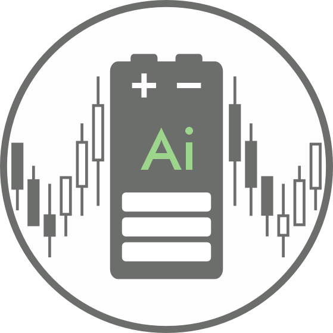

  

  

# IntradayPowerAnalytics
**AI and analytics tools for intraday power markets, including visualisation and analysis of electricity prices, anomaly detection in trading sessions, and trading algorithms for battery energy storage systems**

### EXAMPLES:
To be added...

### RUNNING THE TOOLS:
To be added...

### AUTHORS:
The tools are being developed by Dr. Andrey Churkin and Prof. Pierre Pinson at the Dyson School of Design Engineering, Imperial College London.
This research is part of The ViPES2X project (Fully AI-driven Virtual Power Plant for Energy Storage and Power to X).

### REFERENCES:
To be added...
