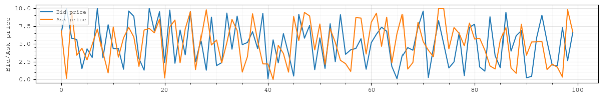

# Example: Random price market
**A simple market example with synthetic price data – useful for developing and testing reinforcement learning (RL) trading models**

In this simple market game, at each time step there are two random prices at the market: 1) Ask price and 2) Bid price.
All prices are randomly generated in the range of [0:10].
The agent wants to earn profit through market arbitrage, which means buying at a lower price and then selling at a higher price. 
The agent has 100 steps per episode to perform such an arbitrage and get profit. The total profit is equal to the prices of all sales minus the prices of purchases. 
At each time step, the agent has three available actions {do nothing, buy, sell}.
A reinforcement learning (RL) model is developed to train the agent to perform effective arbitrage.
The agent's performance is then backtested and compared against the optimal trading decisions (found via mathematical optimisation) and a heuristic trading policy.

### EXAMPLES:
To be added...

  

  

  

### RUNNING THE TOOLS:
To be added...

### AUTHORS:
The tools are being developed by Dr. Andrey Churkin and Prof. Pierre Pinson at the Dyson School of Design Engineering, Imperial College London.
This research is part of The ViPES2X project (Fully AI-driven Virtual Power Plant for Energy Storage and Power to X).

### REFERENCES:
To be added...
