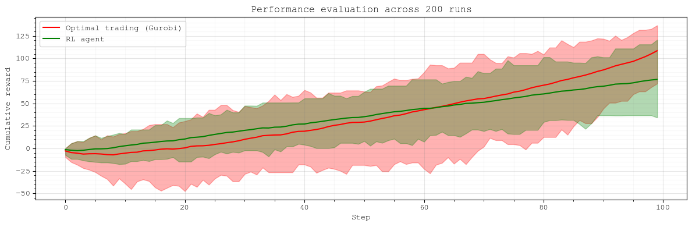
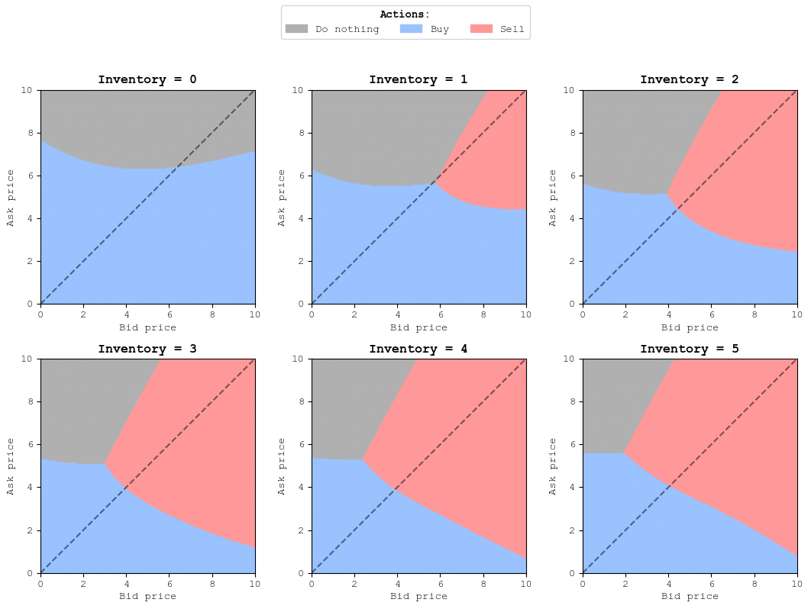

# Example: Random price market
**A simple market example with synthetic price data – useful for developing and testing reinforcement learning (RL) trading models**

In this simple market game, at each time step there are two random prices at the market: 1) Ask price and 2) Bid price.
All prices are randomly generated in the range of [0:10].
The agent wants to earn profit through market arbitrage, which means buying at a lower price and then selling at a higher price. 
The agent has 100 steps per episode to perform such an arbitrage and get profit. The total profit is equal to the prices of all sales minus the prices of purchases. 
At each time step, the agent has three available actions {do nothing, buy, sell}.
A reinforcement learning (RL) model is developed to train the agent to perform effective arbitrage.
The agent's performance is then backtested and compared against the optimal trading decisions (found via mathematical optimisation) and a heuristic trading policy.

### ENVIRONMENT:
The trading environment is formulated in `random_price_market_env.py` using the Gymnasium library.
The RL agent can be trained and saved using `random_price_market_train_and_save.py`. Stable Baselines3 library is used to apply RL algorithms.

A critical feature of the environment is how the Bid/Ask prices are generated. There are three ways of generating random prices for this illustrative example, as defined in `price_generation_mode`:
1. `all_random` – Bid and Ask prices are completely random and independent, within the [0:10] range (this assumption is less realistic, but is allows us to explore different price combinations)  
2. `ask_always_slightly_higher` – Ask price is always a bit higher, but still within [0:10] range (this is a more realistic market representation)  
3. `ask_always_higher` – Ask price can be much higher, but within [0:10] range (this is a more realistic market representation)

Random price markets corresponding to these assumptions are shown below.

Random and independent Bid/Ask prices:

  

Ask price is always slightly higher:

  

Ask price can be much higher:

  

This Bid/Ask price assumption, as well as the reward and penalty values, are the main parameters impacting the agent's training performance and potential trading profits.

### ANALYSIS:
Once the RL agent is trained, its actions can be evaluated in `random_price_market_run_and_analyse.py`.
At the evaluation stage, 100 steps with random prices are generated. The agent observes these states one by one and takes trading actions.
To analyse these actions, two trading benchmarks are introduced: 1) a backtesting mathematical optimisation model (solved with Gurobi), and 2) a heuristic trading policy (sell if price > 5, buy if price <5).
Then, the script visualises the agent's trading action and profits:

  

It can be seen that Gurobi finds the optimal trading decisions that maximise the total profit at the last step of the trading session. This is a useful (yet unrealistic) benchmark.
The RL agent does not see prices for all steps, i.e., it is myopic and observes only the prices at the current step. Nevertheless, it performs quite well (even better than the heuristic trading rule).

The RL agent's performance can be evaluated across multiple runs in `random_price_market_performance_evaluation.py`. The following figure visualises the overall trading performance of the agent and Gurobi, where the areas display the min-max range of profits and the lines show the mean values:

  

Finally, the RL agent's policy can be visualised using `random_price_market_visualise_policy.py`. The script creates a grid of points in the Bid-Ask price space. The agent observes prices at each point of the grid and provides the optimal action for combinations of prices and the inventory at the agent's disposal (that is, purchased items available for sale).
An example of policy visualisation is shown below:

  

The policy is interpretable. With empty inventory, the agent can only buy items or do nothing. This decision depends on the Ask price at a given time step. Then, with a non-empty inventory, there appears an area where selling is the optimal action. Such areas typically have high Bid prices and high Ask prices. This is consistent with the simple logic: if we can sell at a high price, we should better sell, especially when the Ask price is high and we cannot buy cheap.

### FINAL NOTE:
Note that this is a simplistic RL trading example developed for illustrative purposes. The agent's observation space [ask price, bid price, inventory] is made small intentionally for interpretability. The model can be further complexified to be applicable to realistic markets.

